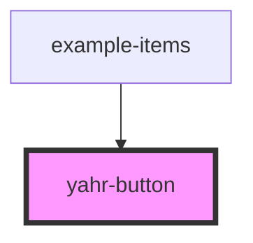

# yahr-button

<!-- Auto Generated Below -->

## Properties

| Property   | Attribute  | Description                                                                                                             | Type                                     | Default     |
| ---------- | ---------- | ----------------------------------------------------------------------------------------------------------------------- | ---------------------------------------- | ----------- |
| `disabled` | `disabled` | If `true`, the user cannot interact with the button.                                                                    | `boolean`                                | `undefined` |
| `href`     | `href`     | Contains a URL or a URL fragment that the hyperlink points to. If this property is set, an anchor tag will be rendered. | `string`                                 | `undefined` |
| `size`     | `size`     | The button size.                                                                                                        | `"large" \| "small"`                     | `'large'`   |
| `type`     | `type`     | The type of button                                                                                                      | `"button" \| "reset" \| "submit"`        | `'button'`  |
| `variant`  | `variant`  | The variants of the button to display.                                                                                  | `"primary" \| "secondary" \| "tertiary"` | `'primary'` |

## CSS Custom Properties

| Name               | Description                  |
| ------------------ | ---------------------------- |
| `--background`     | Background of the button     |
| `--color`          | Text color of the button     |
| `--padding-bottom` | Bottom padding of the button |
| `--padding-left`   | Left padding of the button   |
| `--padding-right`  | Right padding of the button  |
| `--padding-top`    | Top padding of the button    |

## Dependencies

### Used by

 - [example-items](../..)

### Graph

----------------------------------------------

*Built with [StencilJS](https://stenciljs.com/)*
